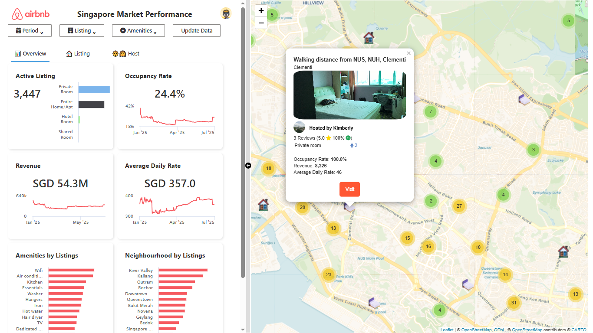

# Airbnb Singapore Market Performance

## 👋 Welcome

This app is my first project on learning how to build a modularized web application using [rhino](https://www.appsilon.com/rhinoverse/rhino). It contains dashboard for monitoring Airbnb market performance based on listed properties on Singapore. 

## Live Demo

You can interact with the [Live Dashboard](https://argaadya.shinyapps.io/airbnb_market_performance/).

## Content of the App

The app has 2 main content:

### 📊 Side Bar

Side bar is where you can interact with the dashboard by click on one of the 3 buttons on the top:

* Period: select the period of reporting to change the occupancy rate, revenue, and ADR (average daily rate) value
* Listing: filter out your listing by interacting with the available drop downs, toggles, and sliders
* Amenities: filter out your listing by selecting only those that has specified amenities

To update or refresh the data, simply press the `Update Data` button on the top right of the side bar. You can resize the side bar by dragging the arrow icon and the middle line. Under the button you will see 3 tab/menu with the following detail:

* Overview: general summary of the market performance, including:
  
  * Active Listing: number of selected listing and their room type
  * Occupancy Rate: total number of days booked compared to total number of period and listing
  * Revenue: total revenue generated based on booked day and listing
  * ADR (Average Daily Rate): average of daily price or rate based on booked day and listing

* Listing: show top 100 listing based on selected variable
* Host: show top 100 listing based on selected variable

### 🗺️ Map

Map shown on the right side of the app display all selected listing and their statistics. You can click the icon of the listing to see the statistics of those listing.

## Data

### Data Source

Credits to [Inside Airbnb](https://insideairbnb.com/get-the-data/) for providing this data. Data are processed from the following file:

* listings.csv: information regarding the listed properties and its respective host
* calendar.csv: availability and price of each listing on particular day from late December 2024 to December 2025
* reviews.csv: reviews given by user toward each listing

### Data Preprocessing

* Listing data are split into 3 separate table:

  * host : all information regarding the host (some hosts can have multiple listings)
  * amenities: all amenities or service provided by the listing
  * listing: all information regarding the listed properties

* Calendar data  are kept as a single table with some cleansing process, including converting the `price` into numeric and `availability` as logical

* Reviews data are split into 2 separate table:

  * user: information regarding the user  
  * review: Reviews data are further processed by adding sentiment flagging column to indicate if a review has a positive, negative, or neutral sentiment using [Twitter Roberta](https://huggingface.co/cardiffnlp/twitter-roberta-base) model.

All processed data are compiled together into [sqlite table](https://github.com/Argaadya/airbnb_market_performance/tree/main/data)

## 🏃 Running the App Locally

1. Restore dependencies. This app is built using `rhino` which relies on `renv` for managing dependencies. Start by running `renv::restore()` to install all necessary packages.
2. Run the app with `rhino::app()` or open the app.R file and click Run App

## 😀 Your Feedback

Do you have a suggestion for improvement? Do you feel like some features or numbers are off? Feel free to give any feedback to me.
